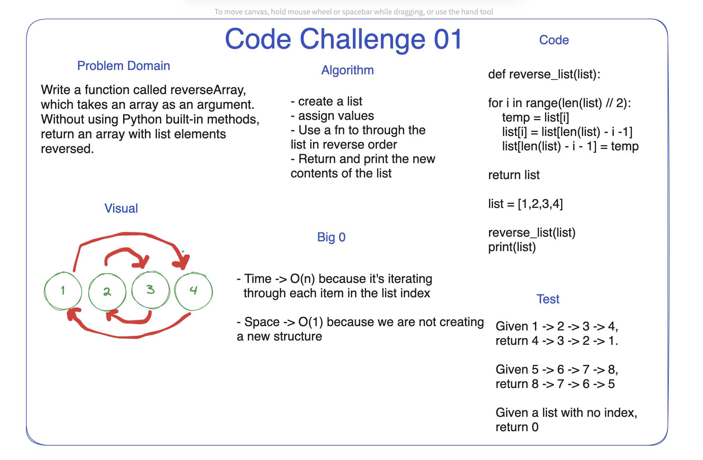

# 401 Python - Data Structures and Algorithms

---------------------------------
## Code Challenge: Class 01
Create a function that returns list elements in reverse order.

Created in a group with Dan Quinn, Anthony Sinista, Jared Ciccarello, Andrew Carroll, and Ashley Taylor

* Resources: Repl.it and Chat GPT

### Whiteboard Process

### Approach & Efficiency

* Dan initially found this solution approach
* Big O include a time complexity of 0(n) and space complexity of 0(1)

### Solution

def reverse_list(list):

for i in range(len(list) // 2):
    temp = list[i]
    list[i] = list[len(list) - i -1]
    list[len(list) - i - 1] = temp

return list

list = [1,2,3,4]

reverse_list(list)
print(list)
