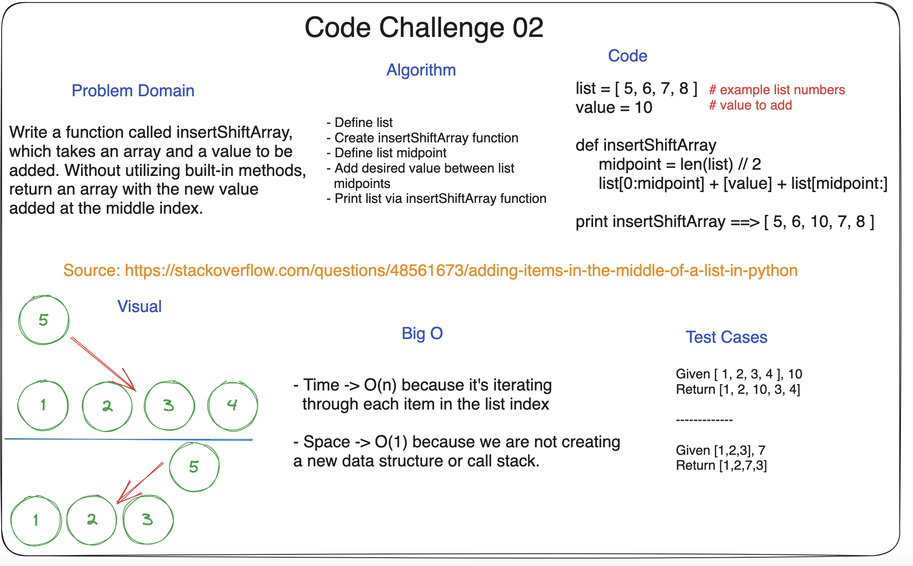

## Code Challenge: Class 02

**Description:**
Create a function called insertShiftArray which takes in an array and a value to be added. Without using built-in methods, return an array with the new value in the middle index.

Created in a group with Dan Quinn, Jared Ciccarello, and Ashley Taylor

* Resource for code construction: (https://stackoverflow.com/questions/48561673/adding-items-in-the-middle-of-a-list-in-python)

### Whiteboard Process

### Approach & Efficiency

* This approach defines the list to be added to, creates a function that defines the list midpoint and adds the value to the middle, then prints the function.

* Regarding efficiency, this solution has a time complexity of O(n) since we are
* Big O include a time complexity of 0(n) and space complexity of 0(1).

### Solution

`list = [ 3, 12, 17, 2, 8 ] # these are random list numbers

def insertShiftArray
    midpoint = len(list) // 2
    shiftArray = list[0:midpoint] + [value to be added] + list[midpoint:]

print insertShiftArray => [ 3, 12, 17, value to be added, 2, 8 ]`

