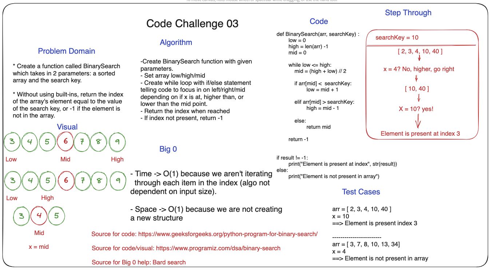

## Code Challenge: Class 03

**Description:**
* Create a function called BinarySearch which takes in 2 parameters: a sorted array and the search key.

* Without using built-ins, return the index of the array's element equal to the value of the search key, or -1 if the element is not in the array.

Created with Dan Quinn

[Code source](https://www.geeksforgeeks.org/python-program-for-binary-search/)

[Code/visual source](https://www.programiz.com/dsa/binary-search)

Big 0 info: Bard search

### Whiteboard Process



### Approach & Efficiency

* This approach creates a function that sets the array's low/mid/high, creates a loop with if/else statement telling the code to focus on left/right/mid depending on if x is at/higher/lower than mid, then returns index when reached, or -1 if not present.

* Big O include a time complexity of 0(1) and space complexity of 0(1).

### Solution

```
def BinarySearch(arr, searchKey) :
        low = 0
        high = len(arr) -1
        mid = 0

        while low <= high:
            mid = (high + low) // 2

            if arr[mid] <  searchKey:
                    low = mid + 1

            elif arr[mid] > searchKey:
                    high = mid - 1

            else:
                    return mid

        return -1


if result != -1:
        print("Element is present at index", str(result))
else:
        print("Element is not present in array")
```
