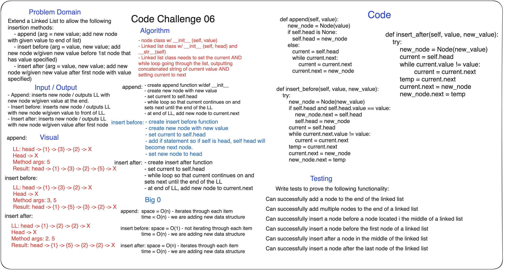

## Code Challenge: Class 06, Linked List Insertions

**Description:**
*
Extend a Linked List to allow the following
insertion methods:
    - append (arg = new value; add new node
with given value to end of list)
    - insert before (arg = value, new value; add
new node w/given new value before 1st node that
has value specified)
    - insert after (arg = value, new value; add new
node w/given new value after first node with value
specified)

### Whiteboard Process

### Approach & Efficiency

### Solution
