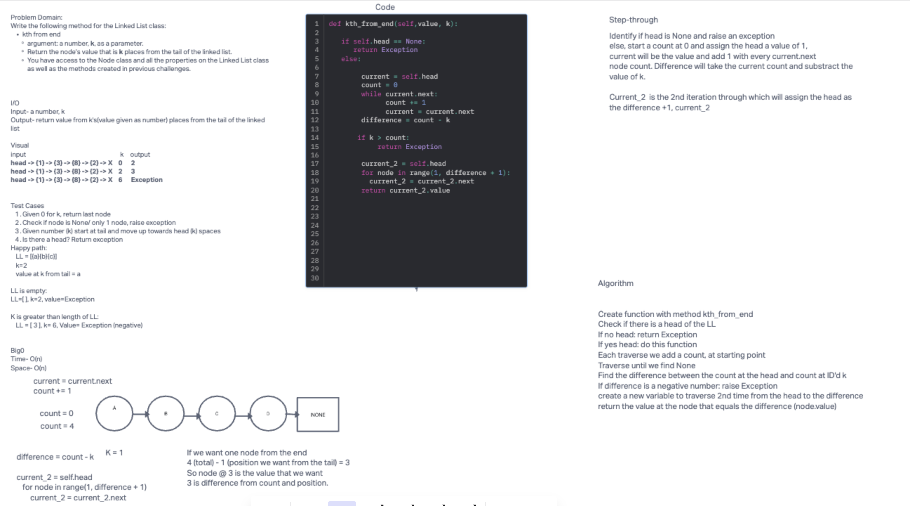

## Code Challenge: Class 07, Linked List Kth from end

Sarah Glass for 401 python
Collaborated with Slava Makeev and Logan Reese
Whiteboard was created as a group via InVision

**Description:**
Write the following method for the Linked List class:

kth from end
argument: a number, k, as a parameter.
Return the node’s value that is k places from the tail of the linked list.
You have access to the Node class and all the properties on the Linked List class as well as the methods created in previous challenges.

### Whiteboard Process

### Approach & Efficiency
Our approach creates a function that traverses through the LL twice - first to count each node in the LL, second to identify the node at Kth from end and return its value.

The Big O is:
- time = O(n) - iterates through each node
- space = O(1) - we are not adding new data structure

### Solution

