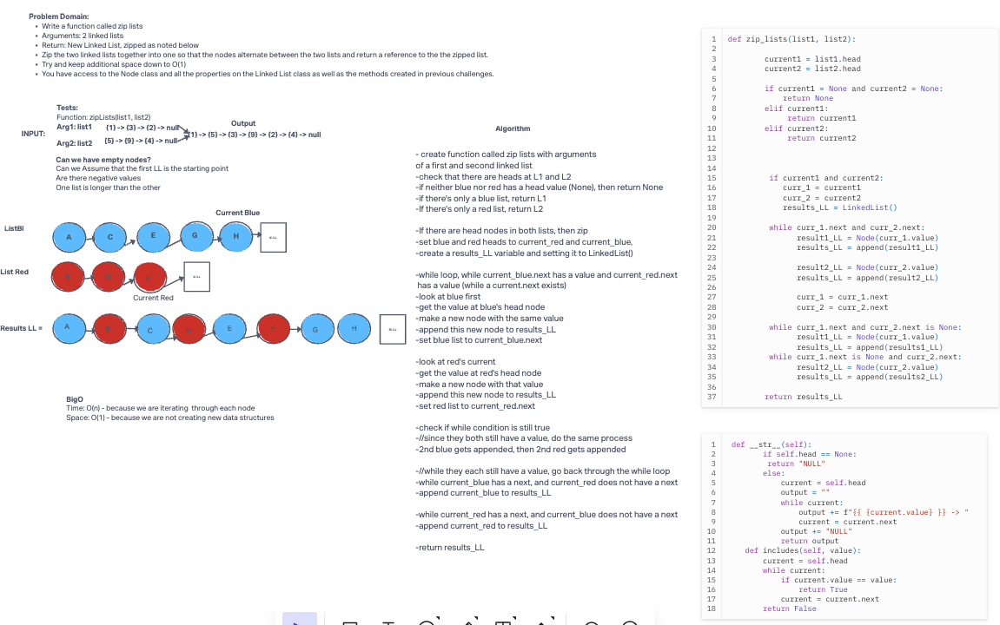

## Code Challenge: Class 08, Linked List Zip

Sarah Glass for 401 python
Collaborated with Slava Makeev and Logan Reese
Whiteboard was created as a group via InVision

Chat GPT prompt and code listed at the end.

**Description:**
Write a function called zip lists
- Arguments: 2 linked lists
- Return: New Linked List, zipped as noted below
- Zip the two linked lists together into one so that the nodes alternate between the two lists and return a reference to the the zipped list.
- Try and keep additional space down to O(1)
- You have access to the Node class and all the properties on the Linked List class as well as the methods created in previous challenges.

### Whiteboard Process

### Approach & Efficiency

The Big O is:
- time = O(n) - iterates through each node
- space = O(1) - we are not adding new data structure

### Solution

'def __str__(self):
        result = ""
        current = self.head
        while current:
            result += str(current.value) + " -> "
            current = current.next
        result += "None"
        return result

def zip_lists(list1, list2):
    current1 = list1.head
    current2 = list2.head
    if not current1 and not current2:
        return None
    results_LL = LinkedList()
    while current1 and current2:
        results_LL.append(current1.value)
        results_LL.append(current2.value)
        current1 = current1.next
        current2 = current2.next
    while current1:
        results_LL.append(current1.value)
        current1 = current1.next
    while current2:
        results_LL.append(current2.value)
        current2 = current2.next
    return str(results_LL)'

### Chat GPT Prompt & Code help

while given two linked lists, I need to zip them into one and return a  new zipped linked list.
Considering this, will this code work? :

def zip_lists(list1, list2):
        current1 = list1.head
        current2 = list2.head
        if current1 == None and current2 == None:
            return None
        elif current1:
             return current1
        elif current2:
             return current2
        if current1 and current2:
            curr_1 = current1
            curr_2 = current2
            results_LL = LinkedList()
        while curr_1.next and curr_2.next:
               result1_LL = Node(curr_1.value)
               results_LL = result1_LL.append
               result2_LL = Node(curr_2.value)
               results_LL = result2_LL.append
               curr_1 = curr_1.next
               curr_2 = curr_2.next
        while curr_1.next and curr_2.next is None:
               result1_LL = Node(curr_1.value)
               results_LL = result1_LL.append
        while curr_1.next is None and curr_2.next:
               result2_LL = Node(curr_2.value)
               results_LL = result2_LL.append
        stringified_linked_list = str(results_LL)
        return stringified_linked_list

ChatGPT
The code you provided has several issues and will not work as expected. Here are the problems and suggested corrections:

In the initial if-else conditions, you are returning the head nodes of list1 and list2 without creating a new linked list. Instead, you should create a new linked list to store the merged elements.

You define results_LL as an instance of LinkedList, but you should initialize it as an empty list instead.

Inside the while loops, you are creating new nodes (result1_LL and result2_LL) but not properly appending them to the results_LL linked list. You need to use the append method on results_LL to add the nodes.

In the second and third while loops, you are not updating curr_1 and curr_2 to their next nodes, resulting in an infinite loop. You should move curr_1 = curr_1.next and curr_2 = curr_2.next inside these loops.

Lastly, the code tries to convert the results_LL into a string using str(results_LL). However, you need to implement the __str__ method in the LinkedList class to correctly convert the linked list to a string representation.

Here's a corrected version of your code:
