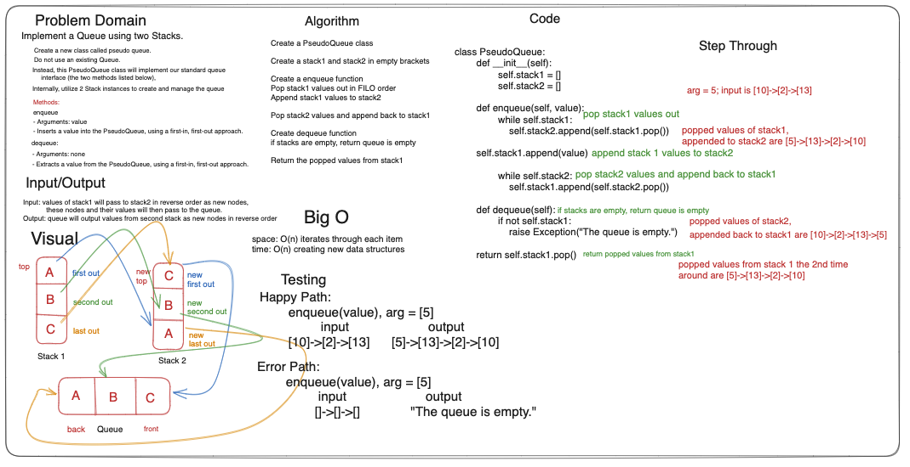

## Code Challenge: Class 11 Stack-Queue-Pseudo

Sarah Glass for 401 python
Collaborated with everyone in the class at a Remo table

**Description:**
Implement a Queue using two Stacks


**1.Create a new class called pseudo queue.**

- Do not use an existing Queue.
- Instead, this PseudoQueue class will implement our standard queue interface (the two methods listed below),
- Internally, utilize 2 `Stack` instances to create and manage the queue

**2. Methods:**

- enqueue
- Arguments: value
- Inserts a value into the PseudoQueue, using a first-in, first-out approach.

**3. dequeue:**

- Arguments: none
- Extracts a value from the PseudoQueue, using a first-in, first-out approach.


### Whiteboard Process



### Approach & Efficiency

The approach was to create the PseudoQueueu class, then empty stacks 1 and 2, then creating an enqueue function that pops stack1 values and appends to stack2, then pops stack2 values and appends back to stack1. Then, dequeue function returns the popped values from stack1 one more time.

The Big O is:

space: O(n) iterates through each item
time: O(n) creating new data structures

### Solution

```python
class PseudoQueue:
    def __init__(self):
        self.stack1 = []
        self.stack2 = []

    def enqueue(self, value):
        while self.stack1:
            self.stack2.append(self.stack1.pop())

        self.stack1.append(value)

        while self.stack2:
            self.stack1.append(self.stack2.pop())

    def dequeue(self):
        if not self.stack1:
            raise Exception("The queue is empty.")

        return self.stack1.pop()
```

### Chat GPT Prompt & Code Help

Help from TAs and peers.
