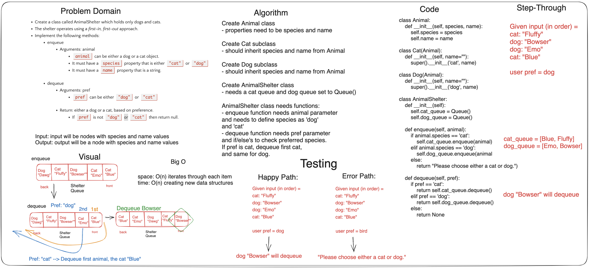

## Code Challenge: Class 12 Stack Queue Animal Shelter

Sarah Glass for 401 python
Collaborated with everyone in the class at a Remo table

**Description:**
First-in, First out Animal Shelter.

**1. Create a class called AnimalShelter which holds only dogs and cats.**

**2. The shelter operates using a first-in, first-out approach.**

**3. Implement the following methods:**

***enqueue***

- Arguments: animal

  - animal can be either a dog or a cat object.

  - It must have a species property that is either "cat" or "dog"

  - It must have a name property that is a string.

***dequeue***

- Arguments: pref

  - pref can be either "dog" or "cat"

  - Return: either a dog or a cat, based on preference; If pref is not "dog" or "cat" then return null.

### Whiteboard Process



### Approach & Efficiency

The approach was to create Dog and Cat classes, in addition to an Animal class and AnimalShelter class with enqueue and dequeue functions.

The Big O is:

space: O(1) doesn't necessarily iterate through each item
time: O(1) creating new data structures

### Solution

```python
class Animal:
    def __init__(self, species, name):
        self.species = species
        self.name = name

class Cat(Animal):
    def __init__(self, name=""):
        super().__init__('cat', name)

class Dog(Animal):
    def __init__(self, name=""):
        super().__init__('dog', name)

class AnimalShelter:
    def __init__(self):
        self.cat_queue = Queue()
        self.dog_queue = Queue()

    def enqueue(self, animal):
        if animal.species == 'cat':
            self.cat_queue.enqueue(animal)
        elif animal.species == 'dog':
            self.dog_queue.enqueue(animal)
        else:
            return "Please choose either a cat or dog."

    def dequeue(self, pref):
        if pref == 'cat':
            return self.cat_queue.dequeue()
        elif pref == 'dog':
            return self.dog_queue.dequeue()
        else:
            return None
```

### Chat GPT Prompt & Code Help

Help from TAs and peers.
