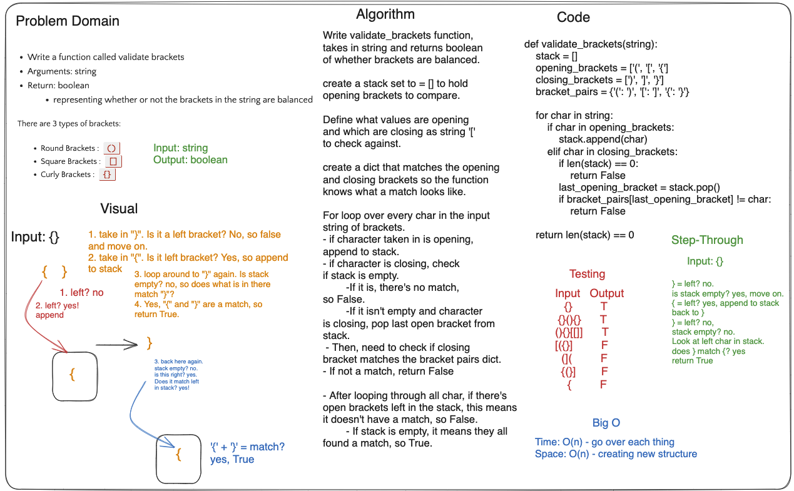

## Code Challenge: Class 13 Stack Queue Brackets

Sarah Glass for 401 Python
Collaborated with everyone in the class at a Remo table

**Description:**

Write a function called validate brackets with arguments: string, return: boolean, needs to represent whether or not the brackets in the string are balanced

There are 3 types of brackets:

- Round Brackets : ()
- Square Brackets : []
- Curly Brackets : {}

### Whiteboard Process



### Approach & Efficiency

The approach was to create a stack to hold left values, define what is left bracket and what is right. Create dictionary that lets code know what is a match. Loop over each character in input string of brackets. Check if char is left, if not, check if stack is empty. If empty, move to next char. If not empty, see if it's a match. When loop comes to left bracket, append to stack for checking later.

The Big O is:

space: O(n) iterate through each item
time: O(n) creating new data structure

### Solution

```python
def multi_bracket_validation(string):
    stack = []
    opening_brackets = ['(', '[', '{']
    closing_brackets = [')', ']', '}']
    bracket_pairs = {'(': ')', '[': ']', '{': '}'}

    for char in string:
        if char in opening_brackets:
            stack.append(char)
        elif char in closing_brackets:
            if len(stack) == 0:
                return False
            last_opening_bracket = stack.pop()
            if bracket_pairs[last_opening_bracket] != char:
                return False

    return len(stack) == 0
```

### Chat GPT Prompt & Code Help

Help from TAs and peers.
