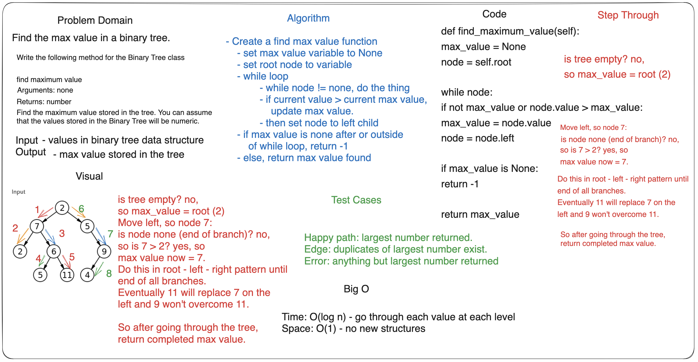

## Code Challenge: Class 16

Sarah Glass for 401 Python
Collaborated with Dan, Anthony, Jared, and Slava in the class at a Remo table

**Description:**

Find the Maximum Value in a Binary Tree.

Write the following method for the Binary Tree class:

- find maximum value
- Arguments: none
- Returns: number
- Find the maximum value stored in the tree. You can assume that the values stored in the Binary Tree will be numeric.

### Whiteboard Process

### Approach & Efficiency

The Big O is:

space: O(log n) iterate through each item on each level of the tree
time: O(1) not creating new data structure

### Solution

[Stack](data_structures/binary_tree.py)

### Chat GPT Prompt & Code Help

Help from TAs and peers.
