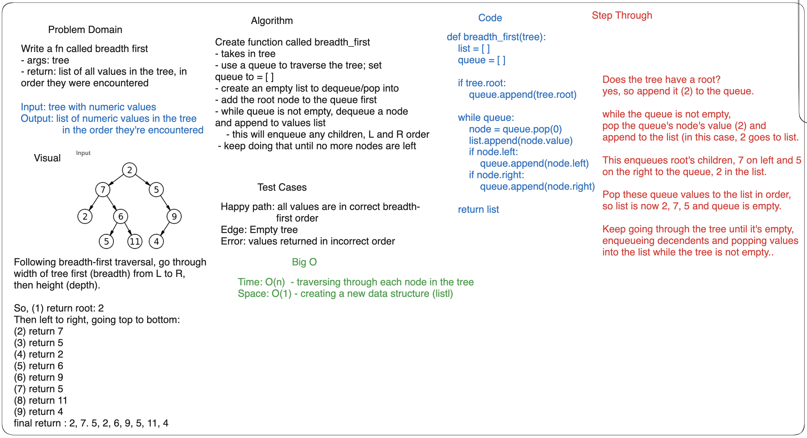

## Code Challenge: Class 17

Sarah Glass for 401 Python
Collaborated with Anthony, Logan, and Slava in the class at a Remo table

**Description:**

Write a function called breadth first
Arguments: tree
Return: list of all values in the tree, in the order they were encountered - in breadth-first order

### Whiteboard Process



### Approach & Efficiency

The approach is to

Time: O(n)  - traversing through each node in the tree
Space: O(1) - creating a new data structure (listl)

### Solution

[Stack](data_structures/binary_tree.py)

### Chat GPT Prompt & Code Help

Help from TAs and Chat GPT help with adding new tests.

Prompt:

Given this code and these tests, what are examples of tests that could be added to check for expected outcome, expected failure, and an edge case?a

Response:

```
def test_expected_outcome():
    tree = BinaryTree()
    tree.root = Node(1)
    tree.root.left = Node(2)
    tree.root.right = Node(3)
    tree.root.left.left = Node(4)
    tree.root.left.right = Node(5)
    tree.root.right.left = Node(6)
    tree.root.right.right = Node(7)

    expected = [1, 2, 3, 4, 5, 6, 7]
    actual = breadth_first(tree)
    assert actual == expected


def test_expected_failure():
    tree = BinaryTree()
    tree.root = Node(1)
    tree.root.left = Node(2)
    tree.root.right = Node(3)
    tree.root.left.left = Node(4)
    tree.root.left.right = Node(5)
    tree.root.right.left = Node(6)
    tree.root.right.right = Node(7)

    expected = [1, 2, 4, 5, 3, 6, 7]  # Incorrect expected order
    actual = breadth_first(tree)
    assert actual == expected


def test_edge_case():
    tree = BinaryTree()

    expected = []
    actual = breadth_first(tree)
    assert actual == expected
```
