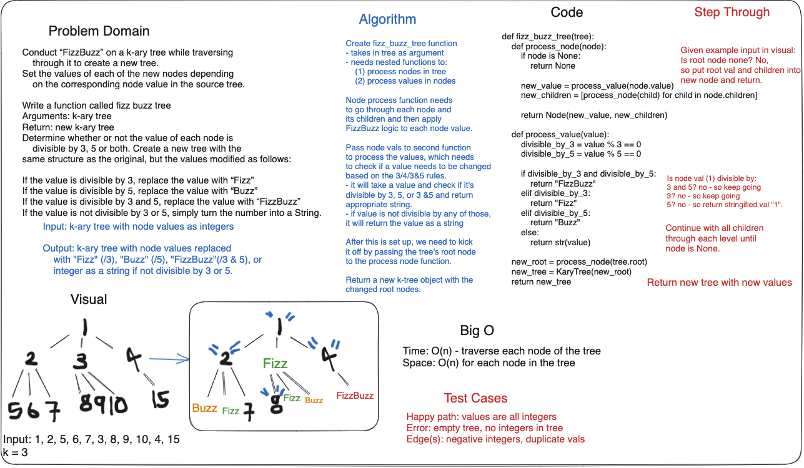

## Code Challenge: Class 18

Sarah Glass for 401 Python
Collaborated with Anthony, Dan, Logan, and Jared in the class at a Remo table

**Description:**

Conduct “FizzBuzz” on a k-ary tree while traversing through it to create a new tree.

Set the values of each of the new nodes depending on the corresponding node value in the source tree.

Write a function called fizz buzz tree
Arguments: k-ary tree
Return: new k-ary tree

Determine whether or not the value of each node is divisible by 3, 5 or both. Create a new tree with the same structure as the original, but the values modified as follows:

- If the value is divisible by 3, replace the value with “Fizz”
- If the value is divisible by 5, replace the value with “Buzz”
- If the value is divisible by 3 and 5, replace the value with “FizzBuzz”
- If the value is not divisible by 3 or 5, simply turn the number into a String.


### Whiteboard Process



### Approach & Efficiency

The approach is to use two nested functions to process each node in the tree and then eaach value in the tree according to the /3 /5 /3&5 rules.

Time: O(n)  - traversing through each node in the tree
Space: O(n) - creating a new data structure for each node in the tree

### Solution

[Stack](code_challenges/tree_fizz_buzz.py)

### Chat GPT Prompt & Code Help

Help from TAs and Chat GPT help with adding new tests.

Prompt:

Given this code and these tests, what are examples of tests that could be added to check for expected outcome, expected failure, and an edge case?

Response:

```

def test_single_node():
    node = Node(7)
    tree = KaryTree(node)
    fizz_buzz_result = fizz_buzz_tree(tree)
    expected = ["7"]
    assert fizz_buzz_result.breadth_first() == expected

def test_non_integer_values():
    tree = KaryTree(Node("Hello", [Node("World")]))
    fizzy_tree = fizz_buzz_tree(tree)
    actual = fizzy_tree.breadth_first()
    expected = ["Hello", "World"]
    assert actual == expected

def test_empty_tree():
    tree = KaryTree()
    fizzy_tree = fizz_buzz_tree(tree)
    actual = fizzy_tree.breadth_first()
    assert actual == []

```
