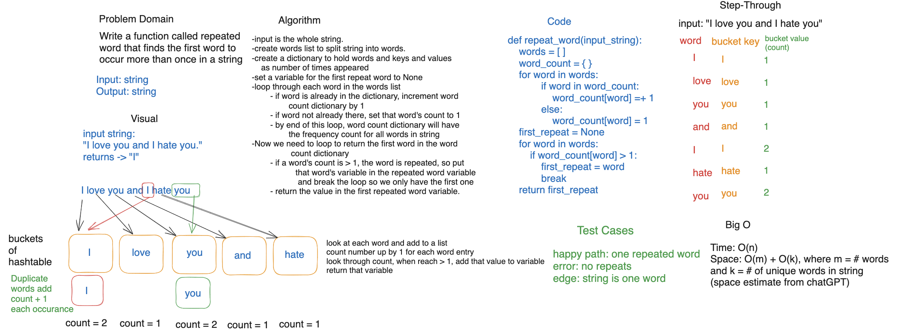

## Code Challenge: Class 31

Sarah Glass for 401 Python
Collaborated with Anthony, Dan, Slava, and Logan in the class at a Remo table

**Description:**

Feature Tasks:

- Write a function called repeated word that finds the first word to occur more than once in a string
- Arguments: string
- Return: string

### Whiteboard Process



### Approach & Efficiency

Time: O(n)  - traversing through each word in the string via dictionary
Space: O(m) + O(k) where m is number of words, and k is number of unique words (this space requirement taken as suggetion from chatGPT)

### Solution

[Stack](code_challenges/hashtable_repeated_word.py)

### Chat GPT Prompt & Code Help

Help from TAs and Chat GPT help with figuring out space complexity and writing tests.

Prompt:

Given this code and these tests, what are examples of tests that could be added to check for expected outcome, expected failure from no repeated words, and an edge case of a one word string?

Response:

```python
def test_multiple_repeats():
    input_str = "apple banana banana apple cherry banana"
    actual = first_repeated_word(input_str)
    expected = "banana"
    assert actual == expected

def test_no_repeats():
    input_str = "this is a test string with no repeated words"
    actual = first_repeated_word(input_str)
    expected = None
    assert actual == expected

def test_one_word():
    input_str = "apple"
    actual = first_repeated_word(input_str)
    expected = None
    assert actual == expected
```
