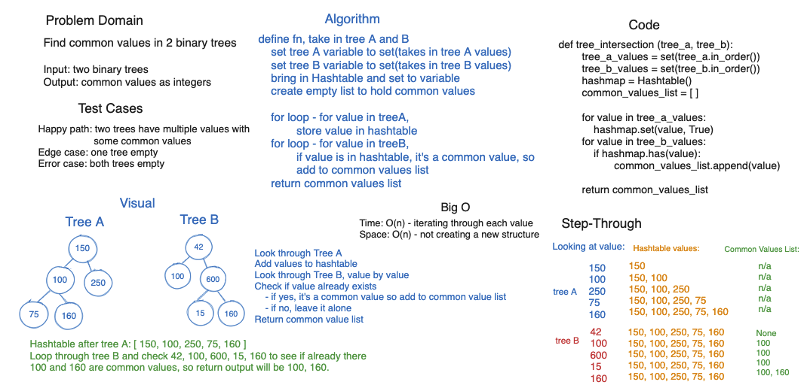

## Code Challenge: Class 32

Sarah Glass for 401 Python
Collaborated with Anthony, Dan, Andrew, Slava, and Logan in the class at a Remo table

**Description:**

Feature Tasks:

- Write a function called `tree_intersection` that takes two binary trees as parameters.
- Using your Hashmap implementation as a part of your algorithm, return a set of values found in both trees.
- Write at least three test assertions for each method that you define.


### Whiteboard Process



### Approach & Efficiency

Time: O(n)  - traversing through each word in the string via dictionary
Space: O(m) + O(k) where m is number of words, and k is number of unique words (this space requirement taken as suggetion from chatGPT)

### Solution

[Stack](code_challenges/tree_intersection.py)

### Chat GPT Prompt & Code Help

Help from TAs and Chat GPT help with figuring out space complexity and writing tests.

Prompt:

Given this code and these tests, what are examples of tests that could be added to check that the tree_intersection function for a happy path, edge case, and error case?

Response:

```python
def test_tree_intersection_happy_path():
    # Create two binary trees with common values
    tree_a = BinaryTree()
    values_a = [5, 2, 8, 1, 4, 6, 9]
    add_values_to_empty_tree(tree_a, values_a)

    tree_b = BinaryTree()
    values_b = [2, 1, 7, 4, 6, 9]
    add_values_to_empty_tree(tree_b, values_b)

    # Expected common values: [1, 2, 4, 6, 9]
    expected = [1, 2, 4, 6, 9]
    assert sorted(tree_intersection(tree_a, tree_b)) == sorted(expected)

def test_tree_intersection_edge_case():
    # Create two binary trees with only one node (same value)
    tree_a = BinaryTree()
    tree_a.root = Node(5)

    tree_b = BinaryTree()
    tree_b.root = Node(5)

    # Expected common value: [5]
    expected = [5]
    assert tree_intersection(tree_a, tree_b) == expected

def test_tree_intersection_error_case():
    # Test with one of the binary trees being None
    tree_a = BinaryTree()
    values_a = [5, 2, 8]
    add_values_to_empty_tree(tree_a, values_a)

    # The second binary tree is None
    tree_b = None

    # Expected common values: []
    assert tree_intersection(tree_a, tree_b) == []

    # Test with invalid data types as input
    tree_c = BinaryTree()
    values_c = [5, 2, 8]
    add_values_to_empty_tree(tree_c, values_c)

    # Pass a string instead of a binary tree as the second parameter
    invalid_input = "not a binary tree"

    # We can expect the function to raise an appropriate exception when invalid data types are provided
    with pytest.raises(Exception):
        tree_intersection(tree_c, invalid_input)
```
