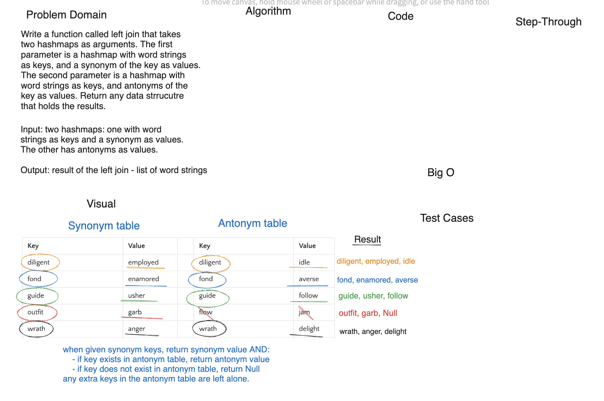

## Code Challenge: Class 33

- Sarah Glass for 401 Python

- Collaborated with Anthony, Dan, Andrew, Slava, and Logan in the class at a Remo table

**Description:**

Feature Tasks:

- Write a function called `left_join` that takes two hash maps as arguments
- The first parameter is a hashmap that has word strings as keys, and a synonym of the key as values.
- The second parameter is a hashmap that has word strings as keys, and antonyms of the key as values.
- Return: The returned data structure that holds the results is up to you. It doesn’t need to exactly match the output below, so long as it achieves the LEFT JOIN logic

Notes:

- Combine the key and corresponding values (if they exist) into a new data structure according to LEFT JOIN logic.
- LEFT JOIN means all the values in the first hashmap are returned, and if values exist in the “right” hashmap, they are appended to the result row.
- If no values exist in the right hashmap, then some flavor of NULL should be appended to the result row.


### Whiteboard Process



### Approach & Efficiency

Time: O(n)  - traversing through each value in each hashtable
Space: O(1) - creates one new data structure

### Solution

[Stack](code_challenges/hashtable_left_join.py)

### Chat GPT Prompt & Code Help

Help from TAs and Chat GPT help with figuring out space complexity and writing tests.

Prompt:

Given this code and these tests, what are examples of tests that could be added to check that the tree_intersection function for a happy path, edge case, and error case?

Response:

```python

```
