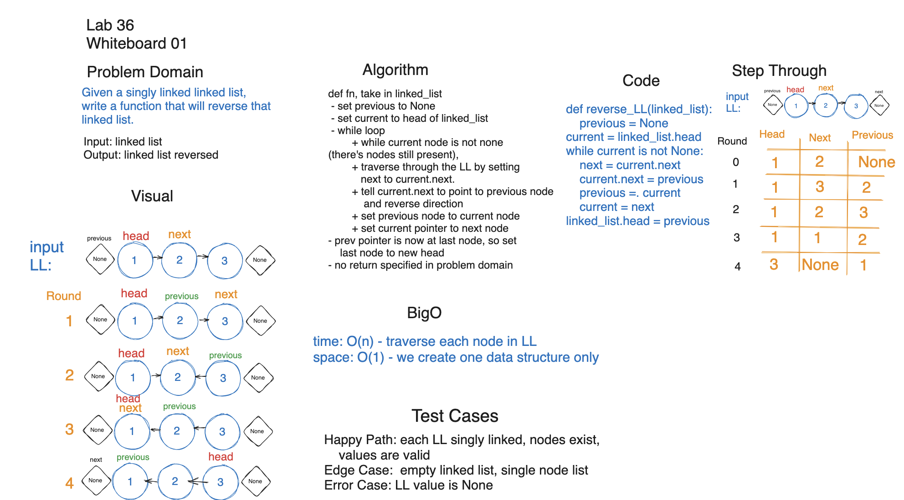
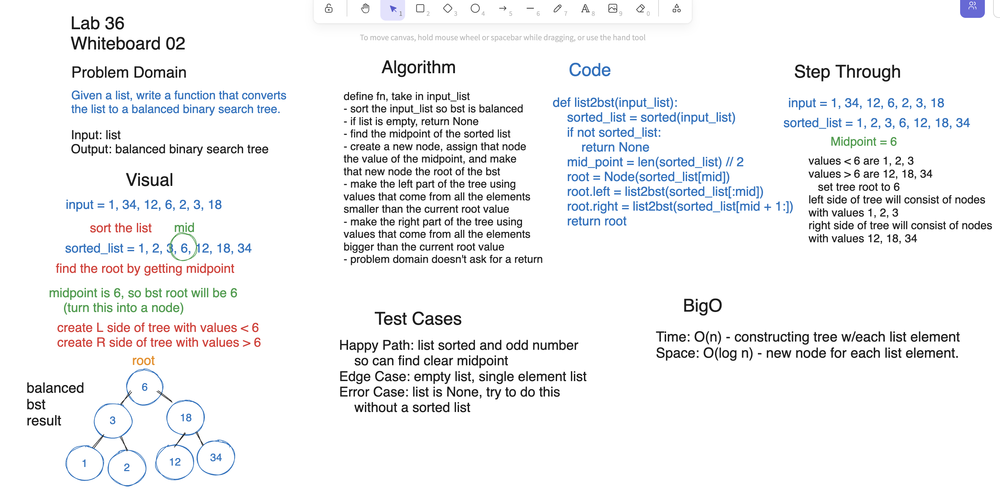

## Lab: Class 36

- Sarah Glass for 401 Python

**Description:**

- Submission is image of white board for 2 (or more) code challenges of your choosing.
- The challenges should relate to the Top 10 list in videos.
- In other words, select challenges that best align with your Coding Interview needs.
- Choose from LeetCode, Exercism, HackerRank, etc.
- No code files accepted. All work should be done within whiteboard.
- Your white board tool is up to you.

### Whiteboard Process

### Solution

See Whiteboard for solution and BigO

### Chat GPT Prompt & Code Help

Help from previous class notes and chatGPT prompts to clarify logic.
